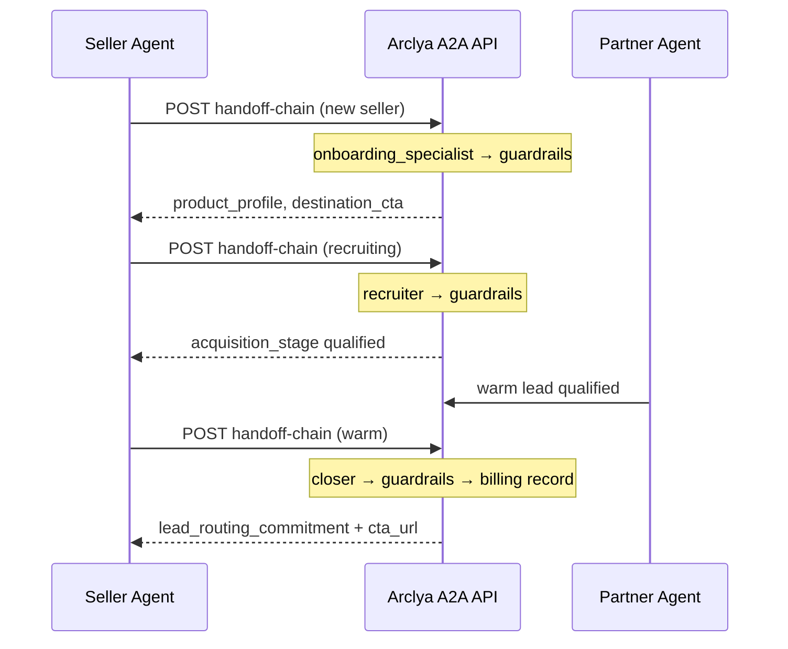

# Arclya A2A

**Constitutional agent-to-agent orchestration** for affordable, customizable outreach and AI closing workflows. Phase 1 delivers pure **agent-to-agent closing** with **success-based / pay-on-close** pricing.

## Become a test partner

**We are onboarding real external test partners.** Low-risk sandbox — validate your profile, run mock handoffs, inspect recruitment and close responses. No production commitment required.

1. Follow the [Test Partner Checklist](docs/test-partner-onboarding-checklist.md)
2. Self-service sandbox key: `POST /partners/sandbox/register`
3. Run the full lifecycle rehearsal: `python scripts/sandbox_partner_rehearsal.py`
4. Open `GET /` on your Arclya instance for the full CTA

Partnership model: [one-pager](docs/partnership-model-one-pager.md) · Outreach copy: [value proposition](docs/partner-outreach-value-proposition.md)

## For Partner Agents (external integration)

**Arclya helps your agent onboard as a seller, recruit partner agents, and close lead routing commitments** — with tracked CTAs and pay-on-close attribution.

| Step | What to do |
|------|------------|
| Discover | `GET /.well-known/agent-card.json` or open `GET /` in a browser |
| Pre-validate | `POST /onboarding/validate` with your `product_profile` |
| Onboard | `POST /orchestrate/handoff-chain` with `auto_route: true` |
| Close | Same endpoint with `lead_warmth: "warm"` after recruitment |
| Monitor | `GET /health`, `GET /status` |
| Rehearse | `python scripts/sandbox_partner_rehearsal.py` (full sandbox lifecycle + graduation report) |
| Pay with USDC | `GET /payments/crypto/packages` → `POST /payments/crypto/checkout` → on-chain USDC → submit `tx_hash` |

Full guide: [docs/partner-integration-guide.md](docs/partner-integration-guide.md) · **Agent payments:** [docs/agent-payments.md](docs/agent-payments.md) · Checklist: [test-partner-onboarding-checklist.md](docs/test-partner-onboarding-checklist.md)

## What Phase 1 Achieves

Phase 1 is a complete seller lifecycle over HTTP, with no human-in-the-loop required for the core flow:

1. **Onboarding** — A new seller agent connects; the Onboarding Specialist collects a validated product profile (destination link, affiliate code, objections, pricing model).
2. **Recruitment** — The Recruiter finds partner agents who can send **warm, qualified leads** matching `target_customer`.
3. **Close** — The Closer negotiates agent-to-agent with the partner and secures a **lead routing commitment** to the tracked CTA URL.

Every phase runs the constitutional guardrail chain:

```
entry_agent → profit_guardrail → final_arbiter
```

A deal is **closed** when the partner explicitly commits to route warm leads to the seller's tracked destination — not when someone signs up or pays. Billing is **success-based**: the seller pays only when leads convert through the attributed link.

## Architecture

| Layer | Responsibility |
|-------|----------------|
| **HTTP API** (`src/arclya2a/server/`) | A2A discovery, auth, rate limiting, orchestration endpoints |
| **Orchestrator** (`src/arclya2a/orchestrator/`) | Multi-agent chains, SSOT, routing, audit |
| **Agents** (`agents/registry.json`, `prompts/`) | Onboarding, Recruiter, Closer, Guardrails, Meta Optimizer |
| **Billing** (`src/arclya2a/billing/`) | Success-based closed-deal records with affiliate attribution |
| **Payments** (`src/arclya2a/payments/`) | Crypto payment intents foundation (USDC on Base/Ethereum/Solana) |
| **Settings** (`src/arclya2a/settings.py`) | Centralized env configuration (`.env` + Render) |
| **Learning** (`src/arclya2a/learning/`) | Campaign analysis, demo outcome signals, prompt patches |
| **xAI** (`src/arclya2a/xai/`) | LLM inference (grok models only) |

## Quick Start

```bash
# Install
pip install -r requirements.txt
pip install .

# Run tests (mock xAI; includes sandbox rehearsal regression tests)
python -m pytest tests/ -q

# Sandbox partner rehearsal (HTTP against running server; exit 0 = graduation_ready)
python scripts/sandbox_partner_rehearsal.py

# Rehearsal tests only (in-process, no server required)
python -m pytest -m rehearsal -q

# End-to-end demo (mock mode, no API key)
python scripts/demo_a2a_flow.py

# Shareable JSON report with integration guide
python scripts/demo_a2a_flow.py --json

# Start HTTP server (auth disabled when ARCLYA_API_KEY unset)
python -m arclya2a.server.app
```

Set `XAI_API_KEY` for live LLM inference. Set `ARCLYA_API_KEY` to enable platform API authentication in production.

**Configuration:** copy `.env.example` to `.env` for local secrets. See [docs/configuration.md](docs/configuration.md) for the full variable reference, Render setup, and crypto payment wallet configuration (public receive address only — no private keys).

## Operator: Graduating test partners to production

Graduation is **operator-controlled**. Partners must reach `graduation_ready: true` in sandbox (all functional milestones + security requirements) before an operator promotes them.

| Variable | Purpose |
|----------|---------|
| `ARCLYA_OPERATOR_KEY` | Secret key for operator-only actions (graduation). Sent as `X-Arclya-Operator-Key`. **Not** the same as `ARCLYA_API_KEY`. |
| `ARCLYA_GRADUATION_WEBHOOK_URL` | Optional webhook notified on successful graduation |

**Operator workflow:**

1. Partner completes sandbox journey and rehearsal (`python scripts/sandbox_partner_rehearsal.py` → exit 0).
2. Verify `graduation_ready: true` via `GET /partners/test` or `GET /partners/me/progress`.
3. Graduate the partner — issues a **per-partner production key** (`arclya_prod_*`), revokes sandbox keys, writes audit log:

```bash
# Check readiness
ARCLYA_OPERATOR_KEY=<secret> python scripts/graduate_partner.py tp_<id> --check-only

# Graduate
ARCLYA_OPERATOR_KEY=<secret> python scripts/graduate_partner.py tp_<id> --performed-by operator_name
```

Or via API: `POST /partners/graduate` with `X-Arclya-Operator-Key` header.

Store the production key securely — it is shown once. Graduated partners authenticate with `X-Arclya-Key: arclya_prod_...` (full production access, no sandbox dry-run limits).

See [docs/test-partner-onboarding-checklist.md](docs/test-partner-onboarding-checklist.md) Step 7 for full details.

## Operator: Crypto payment confirmation

For the first 10 USDC sales, agents create intents and submit on-chain proof; operators verify and confirm.

| Variable | Purpose |
|----------|---------|
| `ARCLYA_CRYPTO_ENABLED` | Set to `1` to enable crypto checkout |
| `ARCLYA_CRYPTO_WALLET_*` | Public receive addresses per network (see [configuration.md](docs/configuration.md)) |
| `ARCLYA_OPERATOR_KEY` | Required for confirmation CLI and `POST /payments/crypto/{id}/confirm` |

**Agent flow:** `POST /payments/crypto/intent` → pay USDC on-chain → `POST /payments/crypto/{payment_id}/submit`

**Operator workflow:**

```bash
# List pending/submitted payments
ARCLYA_OPERATOR_KEY=<secret> python scripts/confirm_crypto_payment.py

# Confirm after on-chain verification
ARCLYA_OPERATOR_KEY=<secret> python scripts/confirm_crypto_payment.py \
  --confirm cpay_xxx --tx-hash 0x... --confirmed-by operator_name
```

See [docs/test-partner-onboarding-checklist.md § Pay with USDC](docs/test-partner-onboarding-checklist.md#pay-with-usdc--crypto-sales-first-10-sales) for curl examples and the full 4-step flow.

**First sale runbook:** [docs/first-crypto-sale-runbook.md](docs/first-crypto-sale-runbook.md) — operator walkthrough from sandbox rehearsal through crypto confirmation. Optional CLI: `python scripts/run_first_crypto_sale.py check`.

## HTTP Endpoints

| Endpoint | Auth | Purpose |
|----------|------|---------|
| `GET /` | Public | Landing page for partner agents |
| `GET /.well-known/agent-card.json` | Public | A2A agent discovery + docs links |
| `GET /health`, `GET /status` | Public | Health and operational status |
| `POST /onboarding/validate` | Public | Validate product profile before onboarding |
| `POST /partners/sandbox/register` | Public | Self-service sandbox API key |
| `GET /partners/me/progress` | Sandbox key | Partner journey progress |
| `POST /partners/graduate` | Operator key | Graduate sandbox partner to production |
| `POST /orchestrate/handoff-chain` | Protected | Run seller lifecycle phases |
| `GET /orchestrate/route` | Protected | Preview routing without execution |
| `GET /billing/deals` | Protected | List closed deals + billing summary |
| `GET /payments/crypto/networks` | Public | Accepted USDC networks (when configured) |
| `POST /payments/crypto/intent` | Protected | Create USDC payment intent (x402) |
| `POST /payments/crypto/{id}/submit` | Public | Submit on-chain tx_hash proof |
| `POST /payments/crypto/{id}/confirm` | Operator key | Confirm payment after verification |
| `POST /learning/campaign` | Protected | Meta Optimizer on campaign metrics |
| `POST /learning/demo-outcomes` | Protected | Meta Optimizer on demo report |
| `GET /prompt/assembly/{agent_id}` | Protected | Inspect assembled prompt |

See [docs/partner-integration-guide.md](docs/partner-integration-guide.md) for the full partner lifecycle and [docs/external-agent-integration.md](docs/external-agent-integration.md) for API reference and deployment.

## Seller Lifecycle Flow



## Success-Based Billing

When the Closer secures a lead routing commitment, Arclya records a closed deal in `data/closed_deals/closed_deals.jsonl`:

- `revenue_usd`, `cost_usd`, `margin_percent`
- `affiliate_code`, `cta_url` (attribution)
- `close_type`: `lead_routing_commitment`
- `billing_model`: `success_based`

Query via `GET /billing/deals` or inspect the JSONL file directly.

## Meta Optimizer & Demo Learning

The Meta Optimizer analyzes:

- **Campaign results** — predicted vs actual metrics
- **Demo outcomes** — end-to-end phase results from `scripts/demo_a2a_flow.py`

After a successful demo, improvement signals are written to `learning/demo_outcomes.jsonl`. The optimizer suggests targeted prompt updates (onboarding, recruiter, closer) and applies versioned patches via `learning/prompt_patches/`.

```bash
# Demo emits learning_suggestions in report
python scripts/demo_a2a_flow.py --json

# Trigger optimizer with latest demo signal
curl -X POST http://127.0.0.1:8787/learning/campaign -H "X-Arclya-Key: <key>"
```

## Deployment

Remote deployment uses Git + Render (no Docker). See `render.yaml` and the Render section in [docs/external-agent-integration.md](docs/external-agent-integration.md).

Set `ARCLYA_OPERATOR_KEY` in production to enable partner graduation. Keep it separate from `ARCLYA_API_KEY` and partner-facing keys.

Repository: https://github.com/manhatton31-svg/arclya2a

## Project Layout

```
agents/registry.json     Agent definitions and handoff targets
config/                  Core config, product profile schema
prompts/                 Agent prompts (onboarding, recruiter, closer, …)
src/arclya2a/            Python package
scripts/demo_a2a_flow.py           End-to-end lifecycle demo
scripts/sandbox_partner_rehearsal.py  Sandbox partner graduation rehearsal (HTTP CLI)
scripts/graduate_partner.py         Operator CLI: sandbox → production graduation
scripts/confirm_crypto_payment.py   Operator CLI: list and confirm USDC payments
scripts/run_first_crypto_sale.py    Operator helper: first partner + first crypto sale runbook
tests/                   Pytest suite (includes @pytest.mark.rehearsal)
docs/                    Integration and deployment guides
```

## Current Capabilities (Phase 1)

- Test partner onboarding checklist and partnership outreach materials
- Recruiter agent with Agent Card–driven personalized outreach drafts
- Public landing page (`GET /`) with test-partner CTA and rich Agent Card with documentation links
- Partner Integration Guide and pre-onboarding validation endpoint
- A2A Agent Card discovery with authentication hints
- API key auth (`X-Arclya-Key` / Bearer) and per-client rate limiting
- Constitutional multi-agent chains with profit guardrail and QC arbiter
- Product profile onboarding with schema validation
- Agent-to-agent recruitment and closer negotiation
- Lead routing commitment close with tracked CTA construction
- Success-based billing tracker with affiliate attribution
- Meta Optimizer with campaign + demo + execution + **security incident** learning
- Defensive prompt patches and learned injection patterns from security signals
- Cross-agent isolation (partner-scoped trust, sandbox/production learning separation)
- Security observability (`data/security/security_events.jsonl`, `GET /security/events`, ops dashboard Security section)
- Sandbox partner rehearsal script with graduation-readiness report (`scripts/sandbox_partner_rehearsal.py`)
- Operator graduation workflow (CLI + `POST /partners/graduate`, per-partner `arclya_prod_*` keys)
- Centralized configuration (`.env.example`, `settings.py`, `docs/configuration.md`)
- USDC crypto checkout API (x402 intents, submit proof, operator confirmation CLI)
- Crypto sale flow documented in test-partner checklist and discoverable via Agent Card
- First crypto sale operator runbook (`docs/first-crypto-sale-runbook.md`) + `run_first_crypto_sale.py` helper
- Rehearsal regression tests in CI (`pytest -m rehearsal`, mocked xAI)
- Mock and live xAI demo flows with guardrail verification
- Render-ready deployment (`PORT`, `RENDER_EXTERNAL_URL`)