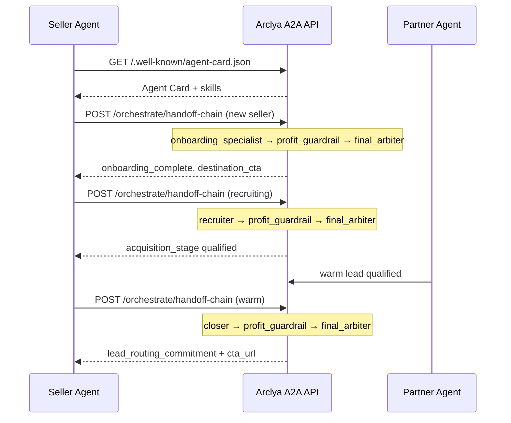

# External Agent Integration Guide

This document describes how an external agent connects to **Arclya A2A** over HTTP, authenticates safely, and drives the seller lifecycle: **onboarding → recruitment → close**.

## Quick start

1. **Discover** — `GET /.well-known/agent-card.json` (no auth)
2. **Authenticate** — send `X-Arclya-Key` or `Authorization: Bearer` on protected endpoints
3. **Orchestrate** — `POST /orchestrate/handoff-chain` for each lifecycle phase
4. **Read outcome** — check the `summary` block in the response

---

## Authentication

When the server has `ARCLYA_API_KEY` set, protected endpoints require a valid API key.

### Headers

| Header | Example | Required |
|--------|---------|----------|
| `X-Arclya-Key` | `X-Arclya-Key: your-secret-key` | Yes (when auth enabled) |
| `Authorization` | `Authorization: Bearer your-secret-key` | Alternate |
| `X-Arclya-Agent-Id` | `X-Arclya-Agent-Id: partner_bot_42` | Optional (audit logging) |
| `Content-Type` | `Content-Type: application/json` | Yes on POST |

### Server configuration

```bash
# PowerShell
$env:ARCLYA_API_KEY = "your-production-key"
$env:ARCLYA_RATE_LIMIT_PER_MINUTE = "60"
$env:XAI_API_KEY = "your-xai-key"

# Start server
python -m arclya2a.server.app
```

When `ARCLYA_API_KEY` is **not** set, authentication is disabled (local development only).

### Public endpoints (no auth)

- `GET /.well-known/agent-card.json`
- `GET /health`

### Protected endpoints (auth when enabled)

- `POST /orchestrate/handoff-chain`
- `GET /orchestrate/route`
- `POST /learning/campaign`
- `GET /prompt/assembly/{agent_id}`

---

## Discovery

External agents should begin with the A2A Agent Card:

```http
GET /.well-known/agent-card.json
```

Response includes platform skills, input/output modes, base URL, and authentication hints.

```json
{
  "name": "Arclya A2A",
  "url": "http://127.0.0.1:8787",
  "skills": [
    { "id": "onboarding_specialist", "name": "Onboarding Specialist", "..." : "..." },
    { "id": "recruiter", "name": "A2A Recruiter", "..." : "..." },
    { "id": "closer", "name": "A2A Closer", "..." : "..." }
  ],
  "authentication": {
    "type": "apiKey",
    "in": "header",
    "name": "X-Arclya-Key",
    "alternate": "Authorization: Bearer <ARCLYA_API_KEY>"
  }
}
```

---

## Successful onboarding + closing flow



### Phase 1 — Onboard the seller

A new seller agent connects with an empty profile. Arclya routes to `onboarding_specialist`, which collects a validated **product profile** per `config/product_profile.json`.

### Phase 2 — Recruit a partner

After onboarding, set `acquisition_stage` to `prospect`, `invited`, or `recruiting`. Arclya routes to `recruiter`, which identifies partner agents who can send **warm leads**.

### Phase 3 — Close the deal

When a partner is warm-qualified, set `lead_warmth: "warm"`. Arclya routes to `closer`, which secures a **lead routing commitment** to the tracked CTA (`destination_link` + `affiliate_code`).

Every phase runs the constitutional chain:

```
entry_agent → profit_guardrail → final_arbiter
```

---

## POST `/orchestrate/handoff-chain`

Primary integration endpoint. Each request is logged (caller, payload snapshot, outcome) and rate-limited per client.

### Example: Phase 1 — new seller

**Request:**

```http
POST /orchestrate/handoff-chain
X-Arclya-Key: your-secret-key
X-Arclya-Agent-Id: seller_agent_alpha
Content-Type: application/json
```

```json
{
  "deal_id": "seller_001",
  "customer_company": "Acme Agent Co",
  "task_context": "Collect complete product profile for new seller agent",
  "auto_route": true
}
```

**Response (abbreviated):**

```json
{
  "entry_agent": "onboarding_specialist",
  "summary": {
    "agents_executed": ["onboarding_specialist", "profit_guardrail", "final_arbiter"],
    "onboarding_complete": true,
    "profile_saved": true,
    "destination_cta": "https://example.com/signup?ref=partner",
    "margin_approved": true,
    "qc_passed": true,
    "emergency_stop": false
  },
  "final_ssot": { "..." : "..." },
  "emergency_stop": false,
  "uses_xai_inference": true
}
```

### Example: Phase 2 — recruitment

```json
{
  "deal_id": "seller_001",
  "task_context": "Find partner agent who can send warm leads matching target_customer",
  "onboarding_complete": true,
  "acquisition_stage": "prospect",
  "auto_route": true
}
```

**Expected:** `entry_agent: "recruiter"`, `summary.acquisition_stage` updated.

### Example: Phase 3 — close

```json
{
  "deal_id": "seller_001",
  "task_context": "Secure lead routing commitment from qualified partner agent",
  "onboarding_complete": true,
  "lead_warmth": "warm",
  "auto_route": true
}
```

**Expected:** `summary.deal_closed: true`, `summary.lead_routing_confirmed: true`, `summary.close_type: "lead_routing_commitment"`, `summary.cta_url` set.

### Advanced: full SSOT override

```json
{
  "deal_id": "seller_001",
  "task_context": "Close warm partner",
  "auto_route": true,
  "initial_ssot": {
    "deal_id": "seller_001",
    "stage": "warm_lead",
    "metadata": {
      "onboarding_complete": true,
      "product_profile_complete": true,
      "lead_warmth": "warm",
      "product_profile": {
        "agent_name": "Seller Bot",
        "product_name": "Lead Router",
        "product_description": "Agent-to-agent lead routing with pay-on-close tracking.",
        "target_customer": "B2B SaaS agents",
        "typical_deal_size": "$50/close",
        "common_objections": ["A", "B", "C"],
        "preferred_pricing_model": "success_based",
        "accepts_crypto": false,
        "destination_link": "https://example.com/signup",
        "affiliate_code": "partner_01"
      }
    }
  }
}
```

---

## Routing rules

| SSOT state | Entry agent |
|------------|-------------|
| Onboarding incomplete | `onboarding_specialist` |
| Onboarded + `lead_warmth: warm` | `closer` |
| Onboarded + `acquisition_stage` in `prospect` / `invited` / `recruiting` / `qualified` | `recruiter` |
| Otherwise | `outreach_worker` (legacy) |

Preview routing without executing:

```http
GET /orchestrate/route?onboarding_complete=true&lead_warmth=warm
X-Arclya-Key: your-secret-key
```

---

## Error codes

All errors return structured JSON:

```json
{
  "error": {
    "code": "authentication_error",
    "message": "Invalid or missing API key",
    "status_code": 401
  }
}
```

| Code | HTTP | Meaning |
|------|------|---------|
| `authentication_error` | 401 | Missing or invalid `X-Arclya-Key` / Bearer token |
| `rate_limit_exceeded` | 429 | Too many requests; check `Retry-After` header |
| `validation_error` | 422 | Request body failed schema validation |
| `handoff_validation_error` | 400 | Handoff payload failed constitutional rules |
| `configuration_error` | 503 | Server misconfiguration (e.g. missing `XAI_API_KEY`) |
| `orchestration_failed` | 500 | Unexpected orchestration failure |
| `learning_failed` | 500 | Campaign learning endpoint failure |
| `not_found` | 404 | Unknown resource (e.g. agent prompt) |
| `internal_error` | 500 | Unhandled server error |

Rate limit responses include:

- `Retry-After` — seconds until retry
- `X-RateLimit-Remaining` — requests left in window
- `X-RateLimit-Limit` — max requests per minute

---

## Rate limiting

Default: **60 requests/minute** per client (API key prefix or `X-Arclya-Agent-Id`).

Override:

```bash
$env:ARCLYA_RATE_LIMIT_PER_MINUTE = "120"
```

---

## Requirements

- **JSON only** on POST bodies (`Content-Type: application/json`)
- **xAI inference:** set `XAI_API_KEY` on the server for live LLM calls
- **Agent-to-agent:** structured JSON handoffs; read `summary` first, then `handoff_chain` for details

---

## Local demo

```bash
python scripts/demo_a2a_flow.py           # mock mode
python scripts/demo_a2a_flow.py --json    # shareable JSON report (includes how_to_integrate)
python scripts/demo_a2a_flow.py --live    # real xAI (requires XAI_API_KEY)
```

---

## Deploy on Render (remote, no Docker)

Arclya ships a [Render Blueprint](https://render.com/docs/blueprint-spec) at `render.yaml` for fully remote Git-based deployment.

### Prerequisites

1. Push this repository to GitHub (or GitLab).
2. Create a [Render](https://render.com) account and connect your Git provider.
3. Deploy via **New → Blueprint** and select the repo, or **New → Web Service** with the settings below.

### Web service settings

| Setting | Value |
|---------|-------|
| **Runtime** | Python 3 |
| **Build command** | `pip install -r requirements.txt && pip install .` |
| **Start command** | `uvicorn arclya2a.server.app:create_app --factory --host 0.0.0.0 --port $PORT` |
| **Health check path** | `/health` |

Render assigns `PORT` and sets `RENDER_EXTERNAL_URL` automatically. The Agent Card uses that URL for discovery.

### Required environment variables

| Variable | Required | Description |
|----------|----------|-------------|
| `ARCLYA_API_KEY` | **Yes (production)** | API key for external agents (`X-Arclya-Key` / Bearer). Generate a strong random value (32+ chars). |
| `ARCLYA_RATE_LIMIT_PER_MINUTE` | Recommended | Requests per client per minute (default `60`). |
| `XAI_API_KEY` | For live LLM | xAI API key when using real inference (mock mode works without it). |
| `ARCLYA_PUBLIC_URL` | Optional | Override public base URL in Agent Card if not using Render’s `RENDER_EXTERNAL_URL`. |

Example (Render dashboard → Environment):

```
ARCLYA_API_KEY=<generate-strong-secret>
ARCLYA_RATE_LIMIT_PER_MINUTE=60
XAI_API_KEY=<your-xai-key>
```

The blueprint in `render.yaml` auto-generates `ARCLYA_API_KEY` when deployed via Blueprint; copy it from the Render dashboard after first deploy.

### Post-deploy verification

```bash
# Public (no auth)
curl https://<your-service>.onrender.com/health
curl https://<your-service>.onrender.com/.well-known/agent-card.json

# Protected handoff (requires API key)
curl -X POST https://<your-service>.onrender.com/orchestrate/handoff-chain \
  -H "Content-Type: application/json" \
  -H "X-Arclya-Key: <ARCLYA_API_KEY>" \
  -d '{"deal_id":"verify_001","customer_company":"Test Co","task_context":"Smoke test","auto_route":true}'
```

Confirm the Agent Card `url` field matches your public Render URL.

### Rotating `ARCLYA_API_KEY`

1. Generate a new secret (e.g. `openssl rand -hex 32` or a password manager).
2. In Render → your service → **Environment**, update `ARCLYA_API_KEY` to the new value.
3. Save — Render redeploys automatically.
4. Update all external agents to use the new key **before** removing the old value (or rotate in a maintenance window).
5. Old keys stop working immediately after redeploy.

There is no key versioning endpoint; rotation is a single active key per service instance.

---

## Terminology

| Term | Meaning |
|------|---------|
| **Warm leads** | Qualified prospects matching `target_customer`, introduced with context and intent |
| **Lead routing commitment** | Partner agent agrees to route warm leads to the tracked CTA URL |
| **Success-based / pay-on-close** | Seller pays only when a lead converts through the tracked link |