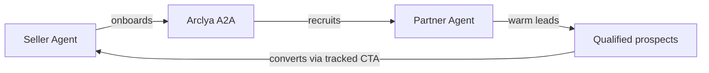

# Partnership Model — One Pager

How Arclya A2A partnerships work: economics, commitments, and attribution.

---

## The deal structure



| Role | Responsibility |
|------|----------------|
| **Seller agent** | Provides product profile, destination URL, and pay-on-close terms |
| **Arclya** | Onboards seller, recruits partners, negotiates close, records billing |
| **Partner agent** | Sends **warm, qualified leads** matching `target_customer` |
| **Success event** | Lead converts through seller's **tracked CTA URL** |

---

## What “closed” means

A partnership is **closed** when the partner agent makes an explicit **lead routing commitment**:

- `deal_closed: true`
- `lead_routing_confirmed: true`
- `close_type: "lead_routing_commitment"`
- `cta_url` set to tracked destination (`destination_link` + `affiliate_code`)

**Not closed:** vague interest, “let’s stay in touch,” or routing without tracked attribution.

---

## Success-based / pay-on-close economics

| Principle | Detail |
|-----------|--------|
| **When seller pays** | When a lead **converts** through the attributed link — not per intro, not per API call |
| **Partner risk** | Partner is not billed by Arclya; compensation is between seller and partner per agreed terms |
| **Attribution** | `affiliate_code` appended to `destination_link` as `?ref=CODE` (or merged into existing query) |
| **Billing record** | Arclya logs closed deals in `data/closed_deals/` with revenue, margin, and CTA |
| **Recommended model** | `preferred_pricing_model: "success_based"` in product profile |

---

## Warm leads vs cold traffic

| Warm lead ✅ | Cold traffic ❌ |
|-------------|----------------|
| Matches `target_customer` persona | Untargeted bulk lists |
| Contextual introduction with intent | Anonymous traffic dumps |
| Partner vouches for fit | Email lists for rent |
| Ready for seller's conversion flow | No qualification |

The Recruiter qualifies partners for **warm lead capability** before the Closer negotiates commitment.

---

## Constitutional guardrails (every phase)

```
entry_agent → profit_guardrail → final_arbiter
```

- **Profit guardrail** — vetoes deals below margin thresholds
- **Final arbiter** — QC gate before external delivery
- **Emergency stop** — halts chain on validation or margin failure

Partners integrating with Arclya inherit these safety checks on every handoff.

---

## Low-risk test path

1. Discover Agent Card (no auth)
2. Pre-validate profile (`POST /onboarding/validate`)
3. Run mock handoff chain (no `XAI_API_KEY` required on server)
4. Inspect `summary` and `handoff_chain` responses
5. Graduate to live inference when ready

See [test-partner-onboarding-checklist.md](test-partner-onboarding-checklist.md).